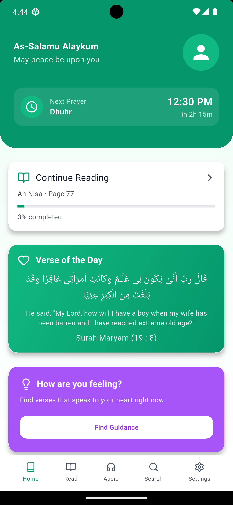
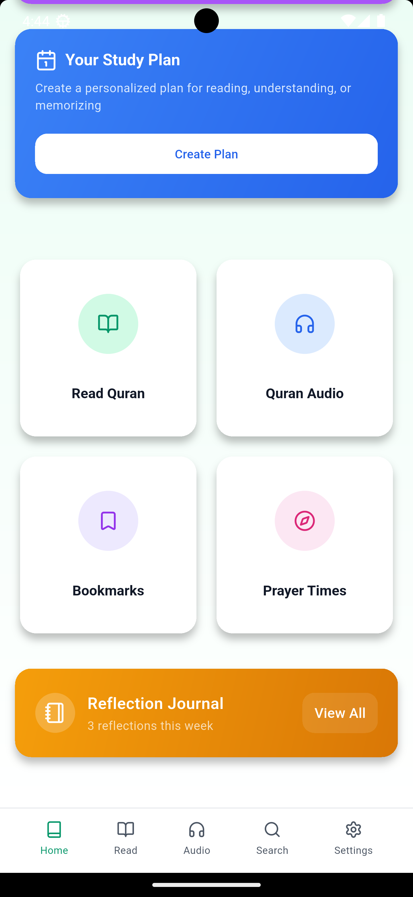
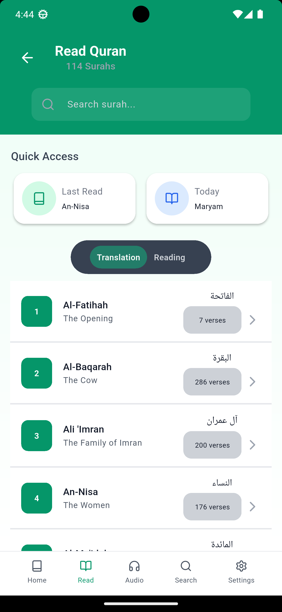
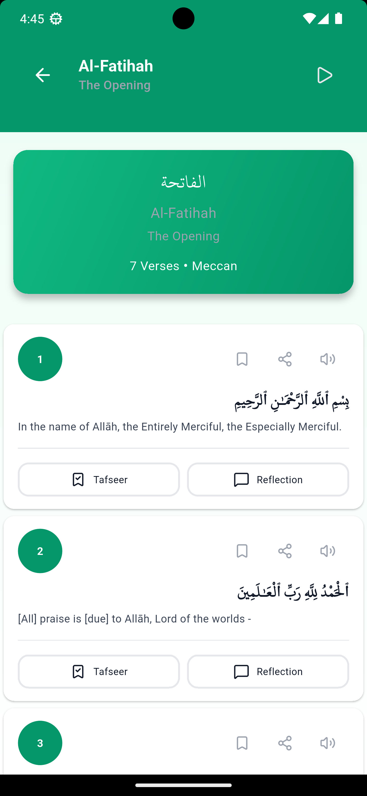
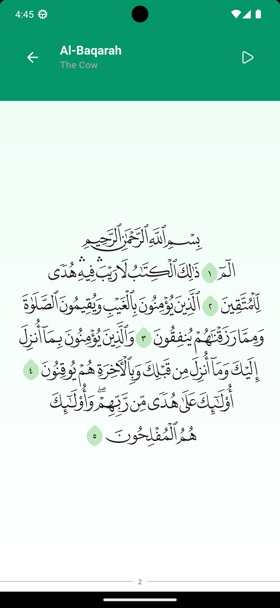
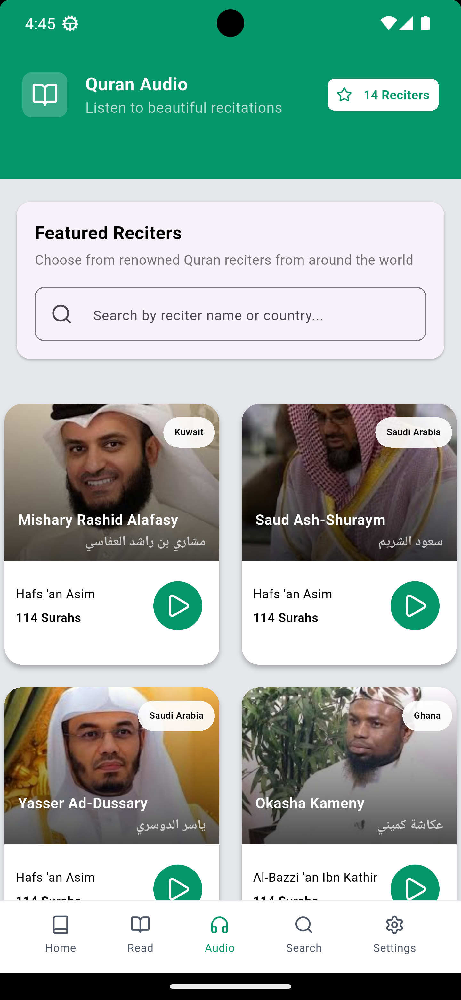
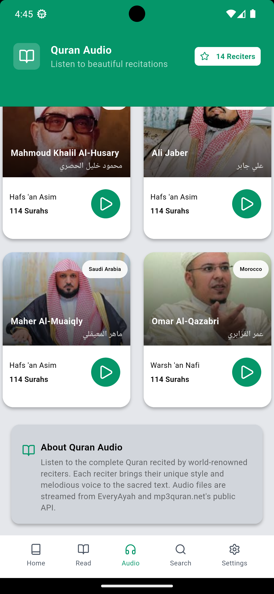

# 📖 Quran App – Premium Streaming & Reading Ecosystem

A modern, high-performance Quran application built with Flutter, focused on **smooth reading, high-quality audio streaming, and offline access**.

---

## 🚀 Features

* 📚 **Offline Quran Reading** (Local JSON)
* 🎧 **Audio Streaming** with multiple reciters
* ⬇️ **Smart Caching System** for offline listening
* 🔁 **Background Audio Playback**
* 🔍 **Fast Surah Search**
* 📌 **Bookmarking & Progress Tracking** *(in progress)*
* ☁️ **Cloud Sync (Firebase)** *(planned)*
* 🌙 **Dark Mode UI** *(planned)*

---

## 🛠️ Tech Stack

* **Flutter** (UI Framework)
* **Riverpod** (State Management)
* **GoRouter** (Navigation)
* **Just Audio** (Audio Playback)
* **SQLite** (Local Storage)
* **Dio** (Networking)
* **Firebase** *(Upcoming)*

---

## 🗺️ Roadmap

### 🟢 Month 1: Core Foundation & Audio ✅

* Project architecture setup
* Offline reading engine
* Audio streaming with background playback
* Smart caching system

### 🟡 Month 2: Progress & Sync 🕒

* Local storage (bookmarks & tracking)
* Continue reading & streak system
* Firebase authentication
* Cloud sync

### 🔴 Month 3: Polish & Launch 🚀

* UI/UX improvements
* Performance optimization
* App branding (icon & screenshots)
* Play Store deployment

---

## 📊 Milestones

| Date         | Milestone               | Status         |
| ------------ | ----------------------- | -------------- |
| March 25     | Offline Audio & Reading | ✅ Complete     |
| April 30     | Progress & Cloud Sync   | 🕒 In Progress |
| June 1, 2026 | Official Launch         | 🚀 Planned     |

---

## 📁 Project Structure

```
lib/
 ├── app/            # App-level configuration (routing, themes, setup)
 ├── assets/         # Local assets (images, JSON, icons)
 ├── core/           # Shared logic (constants, utils, services)
 ├── features/       # Feature-based architecture
 │    ├── audio/     # Audio playback & streaming
 │    ├── progress/  # User progress, bookmarks, tracking
 │    └── quran/     # Quran reading & UI
 └── main.dart       # Entry point
```

---

## ⚙️ Getting Started

### 1. Clone the repository

```bash
git clone https://github.com/YOUR_USERNAME/quran_app.git
cd quran_app
```

### 2. Install dependencies

```bash
flutter pub get
```

### 3. Run the app

```bash
flutter run
```

---

## 📸 Screenshots

## 📸 Screenshots

### 🏠 Home & Navigation
<p align="center">
  
  
  
</p>

---

### 📖 Reading Experience

#### Ayah-by-Ayah Mode
<p align="center">
  
</p>

#### Paged Mode
<p align="center">
  
</p>

---

### 🎧 Audio Experience
<p align="center">
  
  
</p>

---

### 📊 Profile & Progress
<p align="center">
  
</p>

---

## 👨‍💻 Developer

**Abdul Muhsin Tiyumba Shirazu**

---

## ⭐️ Support

If you like this project, consider giving it a ⭐ on GitHub!
